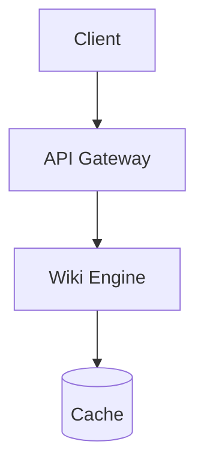

<p align="center">
  
</p>

# @life-exe/wiki-engine

[](https://www.npmjs.com/package/@life-exe/wiki-engine)
[](https://opensource.org/licenses/MIT)
[](https://pnpm.io/)
[](https://www.typescriptlang.org/)
[](https://react.dev/)

Modern, high-performance, multilingual documentation and wiki engine built with **React**, **Vite**, and **Tailwind CSS**.

---

## ✨ Features

- 🌐 **Multilingual & Themed**: Instant language switching (RU / EN / Custom) + Dark/Light mode.
- 🔍 **Fast Full-Text Search**: Built-in instant snippet search (`Ctrl+K` / `Cmd+K`).
- 📑 **Smart Navigation**: Resizable sidebar, curriculum module dividers (`sectionCategories`), and breadcrumbs.
- 💻 **Rich Markdown**: Syntax highlighting (including Unreal Engine C++), Mermaid diagrams, and image lightbox.
- ⚡ **Plug & Play**: Ready-to-use `<WikiApp />` or modular `<WikiProvider>` for custom routes and widgets.

---

## 📋 Prerequisites

Before you begin, make sure your development environment is set up with:

- **Node.js**: `>= 18.0.0` (LTS `v20` or `v22` recommended) — check with `node -v`
- **Package Manager**: [pnpm](https://pnpm.io/) (`>= 9.0.0` recommended, or `npm` / `yarn`) — check with `pnpm -v`
- **Code Editor**: [Visual Studio Code](https://code.visualstudio.com/) (recommended)
  - _Recommended VS Code Extensions_:
    - [Tailwind CSS IntelliSense](https://marketplace.visualstudio.com/items?itemName=bradlc.vscode-tailwindcss)
    - [ESLint](https://marketplace.visualstudio.com/items?itemName=dbaeumer.vscode-eslint)
    - [Prettier - Code formatter](https://marketplace.visualstudio.com/items?itemName=esbenp.prettier-vscode)
- **Git**: Installed for version control (`git --version`)

---

## 📦 Installation

```bash
# Using pnpm
pnpm add @life-exe/wiki-engine

# Using npm
npm install @life-exe/wiki-engine

# Using yarn
yarn add @life-exe/wiki-engine
```

### Peer Dependencies

Make sure the following peer dependencies are installed:

```json
{
  "dependencies": {
    "react": ">=18.0.0",
    "react-dom": ">=18.0.0",
    "react-router-dom": ">=6.0.0"
  }
}
```

---

## 🚀 Quick Start

### 1. Structure your documentation folder

Organize your content by language and sections. Numeric prefixes determine order:

```text
my-project/
├── docs/
│   ├── ru/
│   │   ├── README.md                  # Home page (RU)
│   │   ├── 01-intro.md                # Section overview (RU)
│   │   └── 01-intro/
│   │       ├── 01-getting-started.md  # Lecture / sub-page (RU)
│   │       └── 02-installation.md
│   └── en/
│       ├── README.md                  # Home page (EN)
│       ├── 01-intro.md                # Section overview (EN)
│       └── 01-intro/
│           ├── 01-getting-started.md  # Lecture / sub-page (EN)
│           └── 02-installation.md
├── src/
│   ├── App.tsx
│   ├── wiki.config.tsx
│   ├── wikiData.ts
│   └── main.tsx
```

> [!TIP]
> **Single-Language vs. Multilingual**:
>
> - **Single Language (e.g. English-only)**: Set `defaultLanguage: "en"` and `supportedLanguages: ["en"]`. The engine **automatically hides** the language switch button!
> - **Multilingual (e.g. EN / FR / DE / RU)**: Organize files into language subfolders (`docs/en/`, `docs/fr/`, etc.) and specify `supportedLanguages: ["en", "fr"]`. Missing translations automatically display a fallback banner.

### 2. Prepare data loader (`src/wikiData.ts`)

Use Vite's `import.meta.glob` to load markdown files eagerly:

```ts
import { createWikiData } from "@life-exe/wiki-engine";

export const wikiData = createWikiData({
  sectionsRu: import.meta.glob("../docs/ru/*.md", {
    query: "?raw",
    import: "default",
    eager: true,
  }),
  sectionsEn: import.meta.glob("../docs/en/*.md", {
    query: "?raw",
    import: "default",
    eager: true,
  }),
  lecturesRu: import.meta.glob("../docs/ru/*/*.md", {
    query: "?raw",
    import: "default",
    eager: true,
  }),
  lecturesEn: import.meta.glob("../docs/en/*/*.md", {
    query: "?raw",
    import: "default",
    eager: true,
  }),
  images: import.meta.glob("../docs/**/*.{png,jpg,jpeg,gif,svg,webp}", {
    import: "default",
    eager: true,
  }),
});
```

### 3. Create configuration (`src/wiki.config.tsx`)

```tsx
import { defineWikiConfig, defaultCommunityLinks } from "@life-exe/wiki-engine";
import { BookOpen, Code2 } from "lucide-react";

export const wikiConfig = defineWikiConfig({
  siteTitle: "My Project — Community Wiki",
  brand: {
    title: "MY.WIKI",
    showAccentDot: true,
    homeLink: "/",
  },
  defaultLanguage: "ru",
  supportedLanguages: ["ru", "en"],
  headerLinks: [
    { label: "Website", url: "https://example.com" },
    { label: "GitHub", url: "https://github.com/my-org/my-project" },
  ],
  socialLinks: defaultCommunityLinks,
  icons: {
    guide: <BookOpen size={17} />,
    code: <Code2 size={17} />,
  },
  sectionCategories: {
    intro: [
      {
        id: "start",
        label: { ru: "Быстрый старт", en: "Getting Started" },
        from: "01",
        to: "01",
      },
      {
        id: "advanced",
        label: { ru: "Продвинутое", en: "Advanced" },
        from: "02",
        to: "99",
      },
    ],
  },
  cookieConsent: {
    enabled: false,
  },
});
```

### 4. Render the App (`src/App.tsx`)

#### Option A: Quick All-in-One Setup (`<WikiApp />`)

```tsx
import { WikiApp } from "@life-exe/wiki-engine";
import "@life-exe/wiki-engine/style.css";
import { wikiConfig } from "./wiki.config";
import { wikiData } from "./wikiData";

export default function App() {
  return <WikiApp config={wikiConfig} data={wikiData} />;
}
```

#### Option B: Modular Setup (Custom Routes, Admin Panels & Widgets)

For custom pages, analytics trackers, or floating widgets:

```tsx
import {
  WikiProvider,
  AnalyticsTracker,
  WikiRoutes,
} from "@life-exe/wiki-engine";
import "@life-exe/wiki-engine/style.css";
import { BrowserRouter, useLocation } from "react-router-dom";
import { wikiConfig } from "./wiki.config";
import { wikiData } from "./wikiData";
import { AdminPage } from "./pages/AdminPage";
import { MyCustomWidget } from "./components/MyCustomWidget";

function AppContent() {
  const location = useLocation();
  if (location.pathname.startsWith("/admin")) {
    return <AdminPage />;
  }

  return (
    <>
      <WikiRoutes />
      <MyCustomWidget />
    </>
  );
}

export default function App() {
  return (
    <WikiProvider config={wikiConfig} data={wikiData}>
      <BrowserRouter>
        <AnalyticsTracker />
        <AppContent />
      </BrowserRouter>
    </WikiProvider>
  );
}
```

---

## ⚙️ Configuration API (`WikiConfig`)

| Field                 | Type                                                       | Description                                                                                |
| --------------------- | ---------------------------------------------------------- | ------------------------------------------------------------------------------------------ |
| `brand.title`         | `ReactNode \| { ru?: ReactNode, en?: ReactNode }`          | Brand title in header/sidebar.                                                             |
| `brand.subtitle`      | `ReactNode \| { ru?: ReactNode, en?: ReactNode }`          | Optional subtitle below title.                                                             |
| `brand.logo`          | `ReactNode`                                                | Optional logo icon or image.                                                               |
| `brand.homeLink`      | `string`                                                   | URL navigated to when clicking brand title (default: `"/"`).                               |
| `brand.showAccentDot` | `boolean`                                                  | Display stylish accent square dot next to title (e.g., brand signature).                   |
| `siteTitle`           | `string \| { ru?: string, en?: string }`                   | Browser `<title>` attribute template.                                                      |
| `defaultLanguage`     | `"ru" \| "en" \| string`                                   | Default fallback language (default: `"ru"`).                                               |
| `supportedLanguages`  | `string[]`                                                 | Enabled language codes. If length ≤ 1, language switch button is hidden.                   |
| `headerLinks`         | `WikiHeaderLink[]`                                         | Navigation links in the top header (`label`, `url`, `external`).                           |
| `categories`          | `WikiCategoryConfig[]`                                     | Global section groupings for top-level sidebar navigation.                                 |
| `sectionCategories`   | `Record<string, WikiCategoryConfig[]>`                     | **Course / lecture dividers**: groupings inside specific sections (keyed by section slug). |
| `icons`               | `Record<string, ReactNode>`                                | Named icon map referenced in page frontmatter (`icon: ...`).                               |
| `syntaxLanguages`     | `Record<string, any>`                                      | Custom highlight.js grammars (e.g. Unreal Engine C++).                                     |
| `customComponents`    | `Record<string, ComponentType>`                            | Custom React components usable directly within markdown.                                   |
| `socialLinks`         | `WikiSocialLink[]`                                         | Links rendered by `<community-links />` component.                                         |
| `analytics`           | `{ googleAnalyticsId?: string, linkerDomains?: string[] }` | Google Analytics 4 configuration.                                                          |
| `cookieConsent`       | `WikiCookieConsentConfig`                                  | GDPR / Cookie banner settings (`enabled`, `privacyPolicyUrl`, `message`).                  |
| `enableSearch`        | `boolean`                                                  | Enable or disable full-text search (`Ctrl+K`). Default: `true`.                            |
| `enableThemeToggle`   | `boolean`                                                  | Enable or disable Dark/Light theme switcher. Default: `true`.                              |
| `enableHeader`        | `boolean`                                                  | Display or hide top header bar. Default: `true`.                                           |
| `poweredBy`           | `boolean \| WikiPoweredByConfig`                           | Customize footer copyright, author link, tagline, or disable via `false`.                  |

---

## 📑 Section Dividers (`sectionCategories`)

Group lectures inside any section into clear thematic modules (e.g., lecture dividers in curriculum):

```tsx
export const wikiConfig = defineWikiConfig({
  // ...
  sectionCategories: {
    "game-engine": [
      {
        id: "intro",
        label: { ru: "Введение", en: "Introduction" },
        from: "00",
        to: "01",
      },
      {
        id: "cpp-build",
        label: { ru: "Сборка C++ проектов", en: "Building C++" },
        from: "02",
        to: "06",
      },
      {
        id: "cmake",
        label: { ru: "CMAKE & CONAN", en: "CMake & Conan" },
        from: "07",
        to: "12",
      },
      {
        id: "architecture",
        label: { ru: "Архитектура ядра", en: "Architecture" },
        from: "13",
        to: "99",
      },
    ],
  },
});
```

Matching rules supported:

- **Numeric ranges**: `{ from: "01", to: "05" }` (matches prefixes like `01-intro`, `02-setup`).
- **RegExp patterns**: `{ pattern: /^day\d+/i }`.
- **Custom filter**: `{ filter: (lecture) => lecture.slug.includes("test") }`.

---

## 🎨 Page Frontmatter

Markdown pages support optional YAML frontmatter:

```md
---
order: 2
parent: courses
icon: code
cover: ./cover.png
thumb: ./thumbnail.png
---

# Page Title
```

| Key      | Description                                                                                           |
| -------- | ----------------------------------------------------------------------------------------------------- |
| `order`  | Custom sort order in sidebar (overrides numeric filename prefix).                                     |
| `parent` | Slug of parent section / page to nest under.                                                          |
| `icon`   | Icon name resolved via `wikiConfig.icons`. If unmapped, rendered as raw text/emoji (e.g. `icon: 🚀`). |
| `cover`  | Hero cover image for page headers.                                                                    |
| `thumb`  | Small thumbnail image for section lists and previews.                                                 |

---

## 📝 Markdown Extensions & Rich Elements

### Callouts (Alerts)

GitHub-style alert blocks are supported with thematic icons and colors:

```md
> [!NOTE]
> Helpful background context or notice.

> [!TIP]
> Best practice advice or optimization suggestions.

> [!IMPORTANT]
> Crucial information to remember.

> [!WARNING]
> Warning about breaking changes or potential issues.

> [!CAUTION]
> High-risk operations or potential hazards.
```

### Mermaid Diagrams

Fenced code blocks with language `mermaid` automatically render interactive diagrams:

````markdown

````

### Zoomable Lightbox Images

All standard images are zoomable on click:

```md

```

To opt out of the zoom lightbox (e.g. for badges or logos), add `data-no-zoom`:

```html

```

### Video & Media Embeds

Easily embed YouTube videos or playlists:

```md
https://youtu.be/dQw4w9WgXcQ
```

Or use the built-in React component in markdown:

```html
<youtube-embed url="https://youtu.be/dQw4w9WgXcQ" />
```

---

## ⚡ Unreal Engine C++ Highlighting

To enable syntax highlighting for Unreal Engine C++ types, macros, and specifiers (`UCLASS`, `UPROPERTY`, `FVector`, `TArray`, etc.):

```tsx
import { defineWikiConfig } from "@life-exe/wiki-engine";
import { ueLangs } from "@life-exe/wiki-engine/languages/ue-cpp";

export const wikiConfig = defineWikiConfig({
  // ...
  syntaxLanguages: ueLangs,
});
```

---

## 🛠️ Exported Hooks & Utilities

`@life-exe/wiki-engine` exports several hooks for building custom components:

```tsx
import {
  useWiki, // Full wiki context (config, pages, sections, search)
  useLang, // Current language code ('ru' | 'en' | string)
  useLanguage, // Language state and setLanguage setter
  useTheme, // Theme state ('dark' | 'light') and toggleTheme
  createWikiData, // Data parser utility
  defineWikiConfig, // Typed configuration helper
} from "@life-exe/wiki-engine";
```

---

## 🚀 Starting a Project from Scratch

### Manual Setup (Step-by-Step)

#### 1. Initialize a new Vite + React + TypeScript project

```bash
pnpm create vite my-wiki --template react-ts
cd my-wiki
```

#### 2. Install dependencies

```bash
# Core dependencies
pnpm add @life-exe/wiki-engine react-router-dom lucide-react

# Tailwind CSS v4 setup
pnpm add -D @tailwindcss/vite tailwindcss
```

#### 3. Configure Vite (`vite.config.ts`)

```ts
import { defineConfig } from "vite";
import react from "@vitejs/plugin-react";
import tailwindcss from "@tailwindcss/vite";

export default defineConfig({
  plugins: [react(), tailwindcss()],
});
```

#### 4. Configure Tailwind CSS (`src/index.css`)

```css
@import "tailwindcss";
@source "../node_modules/@life-exe/wiki-engine";
```

#### 5. Create documentation folders

```bash
mkdir -p wiki/ru wiki/en
```

Create `wiki/ru/welcome.md`:

```md
---
order: 0
---

# 🤍 Добро пожаловать

Добро пожаловать в нашу базу знаний!
```

Create `wiki/en/welcome.md`:

```md
---
order: 0
---

# 🤍 Welcome

Welcome to our knowledge base!
```

#### 6. Add `src/wikiData.ts`

```ts
import { createWikiData } from "@life-exe/wiki-engine";

export const wikiData = createWikiData({
  sectionsRu: import.meta.glob("../wiki/ru/*.md", {
    query: "?raw",
    import: "default",
    eager: true,
  }),
  sectionsEn: import.meta.glob("../wiki/en/*.md", {
    query: "?raw",
    import: "default",
    eager: true,
  }),
  lecturesRu: import.meta.glob("../wiki/ru/*/*.md", {
    query: "?raw",
    import: "default",
    eager: true,
  }),
  lecturesEn: import.meta.glob("../wiki/en/*/*.md", {
    query: "?raw",
    import: "default",
    eager: true,
  }),
  images: import.meta.glob("../wiki/**/*.{png,jpg,jpeg,gif,svg,webp}", {
    import: "default",
    eager: true,
  }),
});
```

#### 7. Add `src/wiki.config.tsx`

```tsx
import { defineWikiConfig, defaultCommunityLinks } from "@life-exe/wiki-engine";

export const wikiConfig = defineWikiConfig({
  siteTitle: "My Project Wiki",
  brand: {
    title: "MY.WIKI",
    showAccentDot: true,
    homeLink: "/",
  },
  defaultLanguage: "ru",
  supportedLanguages: ["ru", "en"],
  socialLinks: defaultCommunityLinks,
  cookieConsent: { enabled: false },
});
```

#### 8. Update `src/App.tsx`

```tsx
import { WikiApp } from "@life-exe/wiki-engine";
import "@life-exe/wiki-engine/style.css";
import { wikiConfig } from "./wiki.config";
import { wikiData } from "./wikiData";

export default function App() {
  return <WikiApp config={wikiConfig} data={wikiData} />;
}
```

#### 9. Run development server

```bash
pnpm dev
```

---

## 🤖 AI Assistant Prompt (One-Click Setup)

You can copy and paste the prompt below into **Claude**, **Codex**, **OpenCode**, **Cline**, or **GitHub Copilot** to instantly scaffold a production-ready wiki project with full tooling:

<details>
<summary>📋 <b>Click to copy AI Prompt</b></summary>

```text
You are a full-stack developer. Your task is to scaffold a modern, high-performance documentation website using React, Vite, TypeScript, Tailwind CSS, and the "@life-exe/wiki-engine" package.

STEP 1: BEFORE generating files or writing code, ask the user:
1. "Which languages should this wiki support? (e.g. English-only ['en'], bilingual ['ru', 'en'], French ['fr'], trilingual, or custom?)"
2. "What is your project/wiki name and brand title?"
(If the user already specified these details or tells you to use defaults, proceed with default English-only ['en']).

STEP 2: Once the user provides the answers, generate the project according to these specifications:
1. Package Manager: pnpm
2. Framework: Vite + React 19 + TypeScript
3. Styling: Tailwind CSS v4 with "@tailwindcss/vite", including:
   - @import "tailwindcss";
   - @source "../node_modules/@life-exe/wiki-engine"; in src/index.css
   - import "@life-exe/wiki-engine/style.css"; in src/main.tsx or src/App.tsx
4. Dependencies:
   - Production: @life-exe/wiki-engine, react, react-dom, react-router-dom, lucide-react
   - Dev: @tailwindcss/vite, tailwindcss, prettier, eslint, typescript, vitest, @testing-library/react
5. Quality & CI Scripts (in package.json):
   - "dev": "vite"
   - "build": "tsc -b && vite build"
   - "preview": "vite preview"
   - "format": "prettier --write \"**/*.{ts,tsx,json,md}\""
   - "format:check": "prettier --check \"**/*.{ts,tsx,json,md}\""
   - "lint": "eslint ."
   - "typecheck": "tsc --noEmit"
   - "test": "vitest run"
   - "verify": "pnpm run format:check && pnpm run typecheck && pnpm run lint && pnpm run test"
6. Configuration Files:
   - .vscode/extensions.json (recommended extensions: bradlc.vscode-tailwindcss, dbaeumer.vscode-eslint, esbenp.prettier-vscode)
   - .prettierrc (singleQuote: false, semi: true, tabWidth: 2)
   - eslint.config.js (modern flat config for TypeScript & React)
   - vitest.config.ts or vite.config.ts with test runner configuration
7. Languages & Folder Structure:
   - Fully customizable languages: Supports single-language (e.g. English-only ["en"]), bilingual (e.g. ["ru", "en"]), or multilingual (e.g. ["en", "fr", "de"]).
   - In src/wiki.config.tsx: Configure "defaultLanguage" (e.g. "en") and "supportedLanguages" (e.g. ["en"] or ["en", "fr"]).
   - Note on single language: If "supportedLanguages" contains only 1 language (e.g. ["en"]), the engine automatically hides the language switcher in the header.
   - Documentation folders:
     - For multiple languages: create parallel folders per language code (e.g. wiki/en/, wiki/fr/, wiki/ru/).
     - For single language: organize docs in wiki/en/ (or wiki/).
   - src/wikiData.ts: data loader configured with import.meta.glob for the selected languages.
   - src/wiki.config.tsx: uses defineWikiConfig with siteTitle, brand title, defaultLanguage, supportedLanguages, and headerLinks.
   - src/App.tsx: renders <WikiApp config={wikiConfig} data={wikiData} />.
   - src/main.tsx: standard React root mounting.
8. Starter Content:
   - Welcome page (e.g. 00-welcome.md) in each configured language with YAML frontmatter (order: 0, icon: 🤍).
   - A sample section folder (e.g. guides/) with 2-3 sample markdown articles.
   - At least 1 basic test (e.g. checking that the app mounts or wikiData parses properly).
9. Git Repository & Commits:
   - Initialize git repository (`git init`).
   - Create clean, atomic commits following Conventional Commits format:
     1. "chore: initial project scaffolding with vite, react and tailwind"
     2. "chore: configure prettier, eslint and vitest"
     3. "feat: configure wiki-engine and data loaders"
     4. "docs: add starter documentation files"

Generate all necessary configuration files, dependencies, package.json scripts, test setup, and starter markdown documents so that `pnpm install`, `pnpm run verify`, and `pnpm dev` all pass cleanly immediately.
```

</details>

---

## 📄 License

[MIT](LICENSE) © [Yuri Popov (life-exe)](https://github.com/life-exe)
